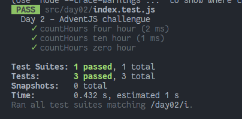

# Nobody wants to do extra hours at work

### Solution

```javascript
export default function countHours (year, holidays) {
  let hours = 0
  for (const holiday of holidays) {
    const date = new Date(`${holiday}/${year}`)
    const isLeap = new Date(date).getDate() === 29
    const isWeekday = date.getDay() > 0 && date.getDay() < 6

    if (!(isLeap || isWeekday)) continue
    hours += 2
  }
  return hours
}
```

### Test

```javascript
import countHours from './index'

const cases = [
  {
    title: 'countHours four hour',
    year: 2023,
    holidays: ['01/06', '04/01', '12/25'],
    expected: 4
  },
  {
    title: 'countHours ten hour',
    year: 1985,
    holidays: ['01/01', '01/06', '02/02', '02/17', '02/28', '06/03', '12/06', '12/25'],
    expected: 10
  },
  {
    title: 'countHours zero hour',
    year: 2000,
    holidays: ['01/01'],
    expected: 0
  }

]

describe('Day 1 - AdventJS challengue', () => {
  test.each(cases)('$title', ({ year, holidays, expected }) => {
    expect(countHours(year, holidays)).toEqual(expected)
  })
})
```

### Screenshot



[Back to the table of challengues](/README.md)
