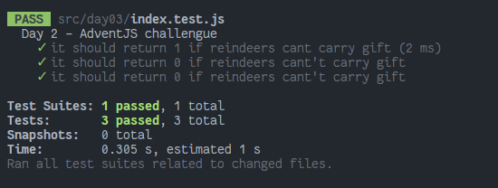

# Nobody wants to do extra hours at work

### Solution

```javascript
export default function distributeGifts (packOfGifts, reindeers) {
  const packWeight = packOfGifts.join('').length
  const reindeersWeight = reindeers.join('').length * 2
  return Math.floor(reindeersWeight / packWeight)
}
```

### Test

```javascript
import distributeGifts from './index'

const cases = [
  {
    title: 'it should return 1 if reindeers cant carry gift',
    packOfGifts: ['a', 'b', 'c'],
    reindeers: ['d', 'e'],
    expected: 1
  },
  {
    title: 'it should return 0 if reindeers cant\'t carry gift',
    packOfGifts: ['videogames', 'console'],
    reindeers: ['midu'],
    expected: 0
  },
  {
    title: 'it should return 0 if reindeers cant\'t carry gift',
    packOfGifts: ['music'],
    reindeers: ['midudev', 'pheralb', 'codingwithdani', 'carlosble', 'blasco', 'facundocapua', 'madeval', 'memxd'],
    expected: 26
  }
]

describe('Day 2 - AdventJS challengue', () => {
  test.each(cases)('$title', ({ packOfGifts, reindeers, expected }) => {
    expect(distributeGifts(packOfGifts, reindeers)).toEqual(expected)
  })
})
```

### Screenshot



[Back to the table of challengues](/README.md)
